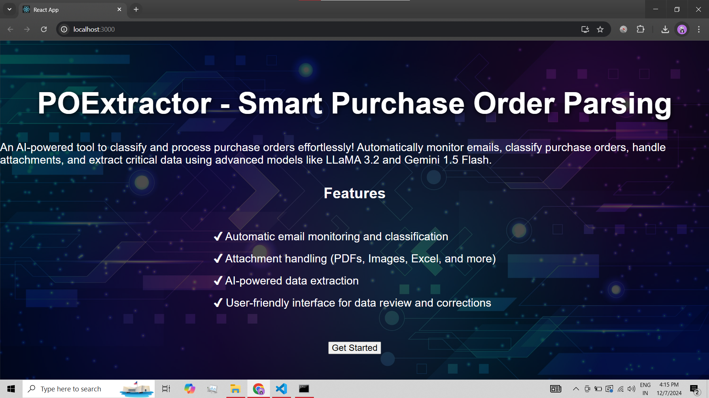

---

# **📧 POExtractor: Smart Purchase Order Parsing**  
🚀 *AI-powered tool to classify and process purchase orders effortlessly!*  

---

## 🌟 **Features**  
🛠️ Our system comes packed with exciting functionalities:  

1. **📬 Automatic Email Monitoring and Classification**  
   - Leverages `imap_tools` for seamless email monitoring.  
   - Automatically identifies whether an email contains a **Purchase Order (PO)**.  

2. **📂 Attachment Handling**  
   - Downloads and processes various attachment formats:  
     - **PDFs** 📝  
     - **Excel/CSV** 📊  
     - **Images** 🖼️.  
     - **Word Documents** 📄  

3. **🔍 Intelligent PO Parsing**  
   - Powered by **LLaMA 3.2 fine-tuning** for classifying emails.
   - **Gemini-1.5-flash** is used for precise data extraction from image POs.
   - Integrates **LLaMA Parser** for extracting critical details from PDF POs like:  
     - Customer PO Number  
     - Item Name, Quantity, and Delivery Dates  
     - Rate, Taxes, and Payment Terms  
   - Excels in handling unstructured data for precise results.
   
4. **🌐 User-Friendly Interface**  
   - Displays extracted data in an intuitive UI built using **FastAPI** and **React**.  
   - Allows manual corrections for missing or inaccurate fields.  

5. **💡 Advanced Features (Under Development)**  
   - Document link support (e.g., Google Docs).  
   - Multi-category classification (e.g., spam, inquiries).  
   - Confidence scores for predictions with manual feedback integration.  

6. **⚡ Retry and Error Handling**  
   - Automatically retries failed extraction attempts.  
   - Highlights errors and missing fields for easy resolution.  

7. **📈 AI-Powered Summarization**  
   - Summarizes email bodies and attachments for a quick overview.  

---

## 🚧 **Technical Stack**  

- **Email Monitoring**: `imap_tools`  
- **Data Extraction**:  
  - Fine-tuned **LLaMA 3.2** for classification tasks.  
  - **Gemini-1.5-flash** for extracting details from image-based attachments.  
  - **LLaMA Parser** for unstructured content and PDFs.  
- **Backend**: **FastAPI** (Python-based)  
- **Frontend**: **React** (JavaScript-based UI)  
- **Database**: **SQLite** (for temporary data storage)  

---

## 🚧 **Project Status**  
⚠️ *This project is a work in progress!*  
- New features and updates are continually being rolled out.  
- Stay tuned for improvements in parsing accuracy and UI enhancements!  

---

## 👨‍💻 **Built By**  
✨ **Shubham Murtadak**  
*GenAI Engineer* 💻💡  

---

## 👩‍💻 **Contribute**  
Want to help make POExtractor even better? 🎉  
- Fork the repo.  
- Submit pull requests.  
- Open issues with ideas or suggestions!  

---

### ✨ **Stay Connected**  
⭐ Star this repo if you’re excited!  
🙌 Reach out to us for ideas, suggestions, or collaborations.  

---

## 📸 **Screenshots**

Here's a preview of the **POExtractor** interface:

This screenshot shows the **React** frontend where the extracted data is displayed for review and correction.

---
