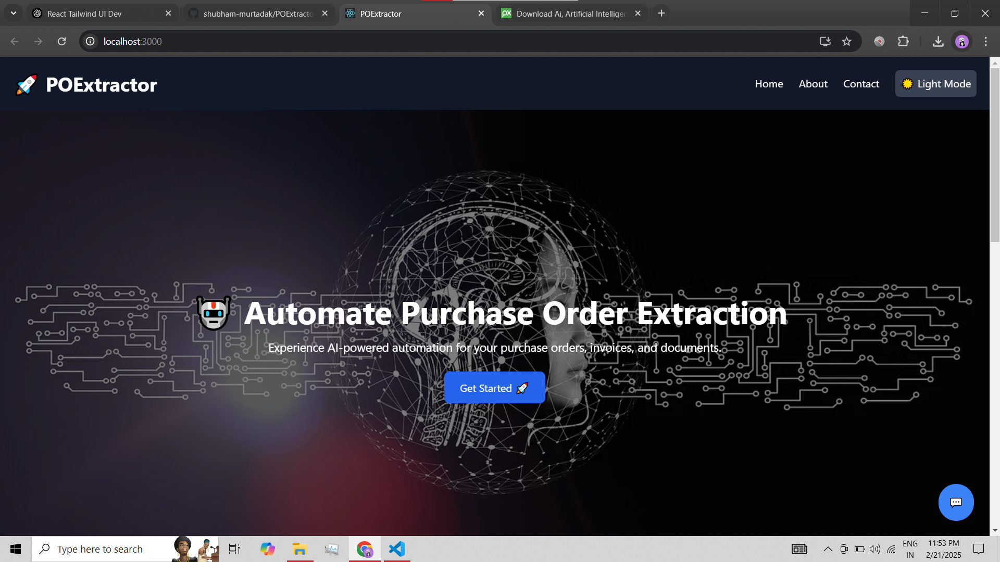
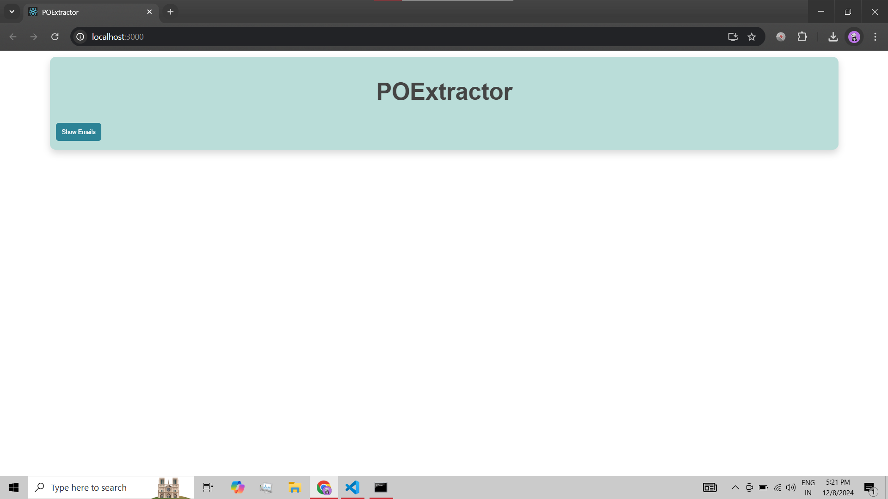
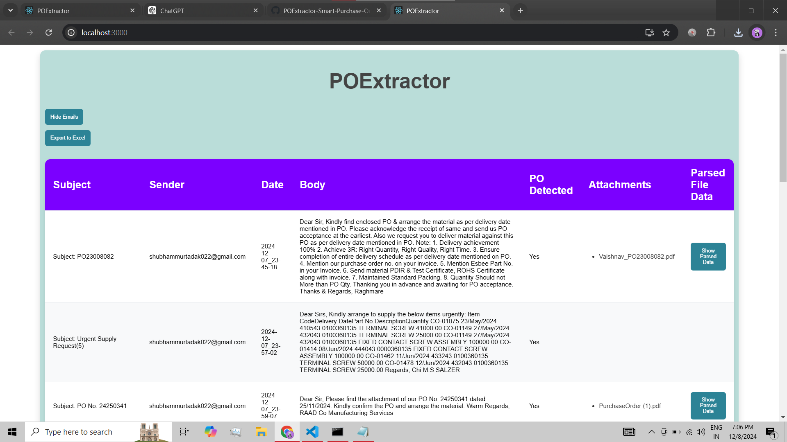
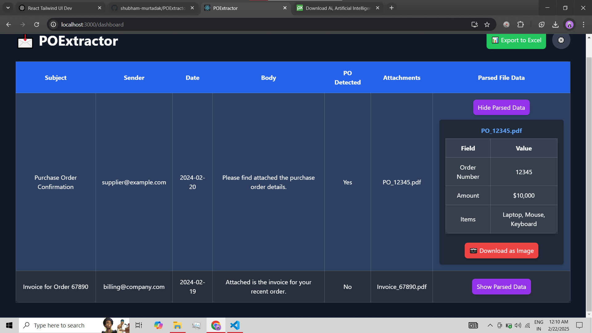
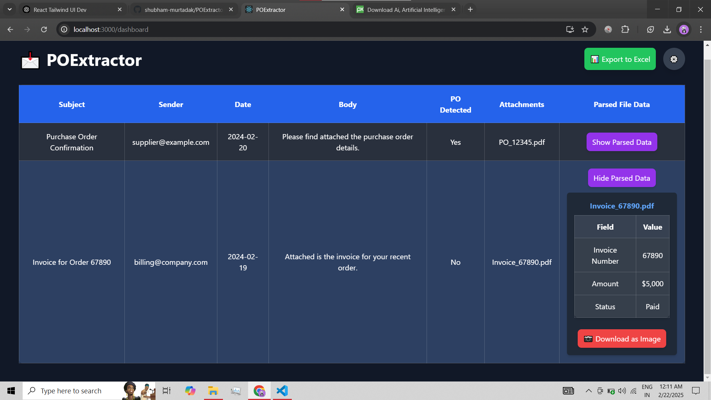

## 🌟 **Features**  
🛠️ **Our system comes packed with exciting functionalities:**

1. **📬 Automatic Email Monitoring and Classification**  
   - Leverages `imap_tools` for seamless email monitoring.  
   - Automatically identifies whether an email contains a **Purchase Order (PO)**.  
   - ⏱️ **Real-time PO classification** as emails arrive!

2. **📂 Attachment Handling**  
   - Downloads and processes various attachment formats with ease:  
     - **PDFs** 📝  
     - **Excel/CSV** 📊  
     - **Images** 🖼️  
     - **Word Documents** 📄  
   - 📥 Supports multiple formats, so no matter what attachment type you have, we’ve got it covered!

3. **🔍 Intelligent PO Parsing**  
   - Powered by **Fine-Tuned LLaMA 3.2** for classifying emails intelligently.  
   - **Fine-Tuned LLAVA** is used for precise data extraction from **image-based POs**.  
   - **LLaMA Parser** extracts critical details from **PDF POs**, such as:  
     - Customer PO Number 📑  
     - Item Name, Quantity, Delivery Dates 📦  
     - Rate, Taxes, Payment Terms 💵  
   - 🧠 **AI-powered accuracy** that excels in handling unstructured data, ensuring precise results.

4. **🌐 User-Friendly Interface**  
   - Extracted data is displayed in an intuitive UI built using **FastAPI** (backend) and **React** (frontend).  
   - ✍️ Allows manual corrections for missing or inaccurate fields, ensuring data is always on point.

5. **💡 Advanced Features (Under Development)**  
   - 📄 **Document link support** (e.g., Google Docs) coming soon!  
   - 🏷️ **Multi-category classification** (e.g., spam, inquiries).  
   - 🧮 **Confidence scores** for predictions with manual feedback integration.  
   - **Real-time document updates** and automated data extraction improvements.

6. **⚡ Retry and Error Handling**  
   - **Automatic retries** for failed extraction attempts, so no PO gets left behind.  
   - 🚨 Errors and missing fields are highlighted for easy resolution, minimizing manual effort.

7. **📈 AI-Powered Summarization**  
   - Summarizes email bodies and attachments for a quick overview, so you never miss critical information! 📋  
   - ⚡ Fast and reliable summarization, saving you time and boosting productivity.

---

## 🚧 **Technical Stack**  

🔧 **What powers POExtractor?**  

- **Email Monitoring**: `imap_tools`  
- **Data Extraction**:  
  - **Fine-Tuned LLaMA 3.2** for email classification.  
  - **Fine-Tuned LLAVA** for extracting details from image-based POs.  
  - **LLaMA Parser** for unstructured content and PDFs.  
- **Backend**: **FastAPI** (Python-based)  
- **Frontend**: **React** (JavaScript-based UI)  
- **Database**: **SQLite** (for temporary data storage)

---

## 🚧 **Project Status**  
⚠️ *This project is a work in progress!*  
- **New features** and updates are continually being rolled out.  
- **Stay tuned** for improvements in parsing accuracy, UI enhancements, and new integrations. 🚀

---

## 🚀 **Upcoming Updates**  
- **Fine-Tuned LLaMA 3.2** and **LLAVA** integration for enhanced classification and data extraction.  
- Currently, we are using the **open-source Mixtral-8x7B-32768 model**, but the next steps will focus on implementing **Fine-Tuned LLaMA 3.2** and **LLAVA** for more accurate and efficient processing.  
- **Expansion for HR Professionals**: In future updates, **POExtractor** will be expanded to classify emails based on **job openings** and perform similar **data extraction** for recruitment processes.  

---

## 👨‍💻 **Built By**  
✨ **Shubham Murtadak**  
*GenAI Engineer* 💻💡  

---

## 👩‍💻 **Contribute**  
Want to help make **POExtractor** even better? 🎉  
- **Fork the repo**  
- **Submit pull requests**  
- Open **issues** with ideas or suggestions!  

🚀 **Looking for a React Developer** to help build an even more **awesome UI**! If you’re passionate about frontend development and want to contribute to creating an amazing user experience, **I’d love to have you on board!** 🌟

---

### ✨ **Stay Connected**  
⭐ **Star this repo** if you’re excited!  
🙌 **Reach out** for ideas, suggestions, or collaborations. Let’s make this tool even better together!  

---

## 📸 **Screenshots**

Here’s a preview of the **POExtractor** interface in action! 🔥

  
  
  
  
  

This screenshot shows the **React** frontend where the extracted data is displayed for easy review and correction. ✨

---

### 💡 **What's Coming Next?**

🚀 **Upcoming Features** (Under development):
- 🔄 **Real-time document link support** (e.g., Google Docs, other cloud links).  
- 🏷️ **Category Classification** for POs, inquiries, and more!  
- 💬 **AI-powered feedback loop** to continuously improve prediction accuracy.

---

🔧 **More Cool Features You Can Expect Soon**:
- 🛠️ **Faster data extraction** with better error handling.  
- ⚙️ **Smarter AI models** fine-tuned for optimal performance.

---

### 🌍 **Join the Journey**  
We’re just getting started. Join me in making **POExtractor** the ultimate tool for automatic **Purchase Order parsing**. ⭐  

Reach out with ideas, feedback, or if you’re interested in contributing! Let's build something amazing together. 🚀

---
