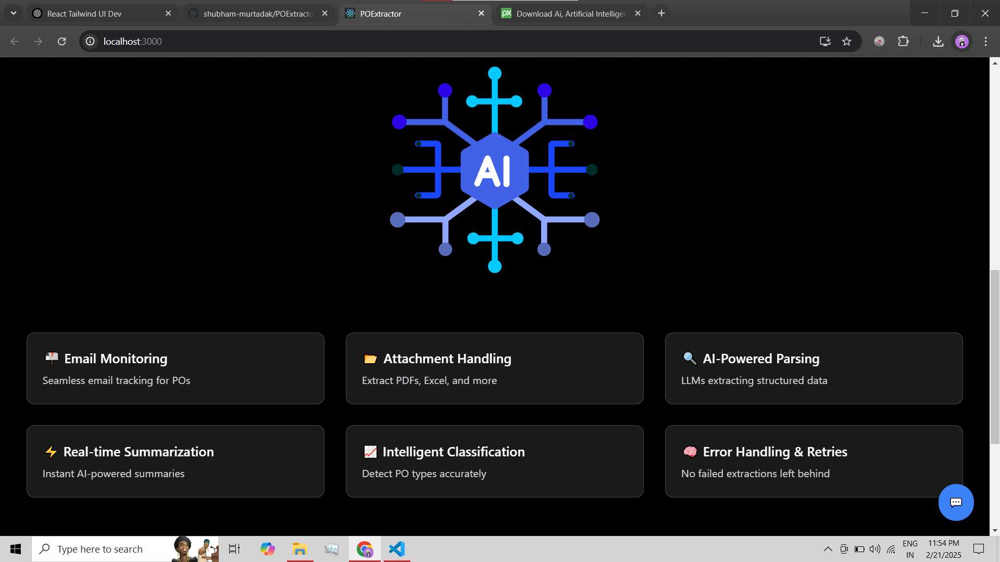
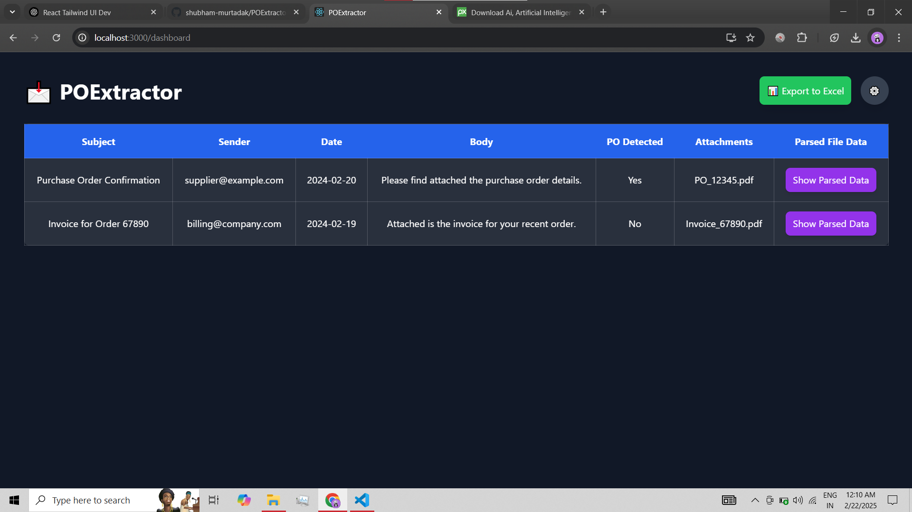

---

# 📧 POExtractor: 🤖 AI-Powered Automated Email Monitoring & 📝 Smart Purchase Order Parsing
🚀 *AI-powered tool to classify and process purchase orders effortlessly!*  
💼 **Built for B2B businesses to streamline purchase order management and optimize workflows.**

---

## 🌟 **Features**  
🛠️ **Our system comes packed with exciting functionalities:**

1. **📬 Automatic Email Monitoring and Classification**  
   - Leverages `imap_tools` for seamless email monitoring.  
   - Automatically identifies whether an email contains a **Purchase Order (PO)**.  
   - ⏱️ **Real-time PO classification** as emails arrive!

2. **📂 Attachment Handling**  
   - Downloads and processes various attachment formats:  
     - **PDFs** 📝 
     - **Excel/CSV** 📊  
     - **Images** 🖼️  
     - **Word Documents** 📄  
   - 📥 Supports multiple formats, ensuring no attachment is left behind!

3. **🔍 Intelligent PO Parsing**  
   - Powered by **Mixtral-8x7B-32768** OpenSource LLM for email classification.  
   - **LLAMA Parser** extracts key details from **PDF POs**, such as:  
     - Customer PO Number 📑  
     - Item Name, Quantity, Delivery Dates 📦  
     - Rate, Taxes, Payment Terms 💵  
   - **LangChain Unstructured Parser** for precise data extraction from **Excel/CSV POs**.  
   - 🧠 **AI-powered accuracy** for handling unstructured data with precision.

4. **🌐 User-Friendly Interface**  
   - Extracted data is displayed in an intuitive UI built using **FastAPI** (backend) and **React** (frontend).  
   - ✍️ Manual corrections for missing or inaccurate fields to ensure data accuracy.

5. **⚡ Retry and Error Handling**  
   - **Automatic retries** for failed extraction attempts.  
   - 🚨 Errors and missing fields are highlighted for easy resolution.

6. **📈 AI-Powered Summarization**  
   - Summarizes email bodies and attachments for a quick overview.  
   - ⚡ Fast, reliable summarization for enhanced productivity.

---

## 🚧 **Technical Stack**  

🔧 **What powers POExtractor?**  

- **Email Monitoring**: `imap_tools`  
- **Data Extraction**:  
  - **Mixtral-8x7B-32768** OpenSource LLM for email classification.  
  - **LLAMA Parser** for extracting details from **PDF POs**.  
  - **LangChain Unstructured Parser** for **Excel/CSV POs**.  
- **Backend**: **FastAPI** (Python-based)  
- **Frontend**: **React** (JavaScript-based UI)  
- **Database**: **SQLite** (for temporary data storage)

---

## 🚧 **Project Status**  
⚠️ *This project is a work in progress!*  
- **New features** and updates are continually being rolled out.  
- **Stay tuned** for improvements in parsing accuracy, UI enhancements, and new integrations. 🚀

---
---

## 🚀 **Future Plans & Updates**  
We have exciting plans for **POExtractor**, including:  
- **🤖Fine-Tuned LLaMA 3.2** to Enhanced Classification and **🔍Fine-Tuned LLAVA** for Image Data Extraction.
- **🌐 Real-time Document Link Support**: Support for document links (e.g., **Google Docs**, cloud links).  
- **💬 AI-Powered Feedback Loop**: Implementing feedback to continuously improve prediction accuracy.  
- **🏷️ Multi-category Classification**: For various PO types, **❌ spam**, and **📩 inquiries**.  
- **⚡ Faster and Smarter AI Models**: Continuous optimization for performance improvements.
- 🤖 AI Agent for Answering Based on Attachments: Introducing an Agentic RAG (Retrieval-Augmented Generation) AI agent to provide accurate answers based on attached documents.
- **👥 Expansion for HR Professionals**: A future update will expand POExtractor to classify emails based on **💼 job openings** and perform similar data extraction for recruitment processes.
---

## 👨‍💻 **Built By**  
✨ **Shubham Murtadak**  *GenAI Engineer* 💻💡  
---
---

## 👩‍💻 **Contribute**  
Want to help make **POExtractor** even better? 🎉 
- **Fork the repo**  
- **Submit pull requests**  
- Open **issues** with ideas or suggestions!  

🚀 **Looking for a React Developer** to help build an even more **awesome UI**! If you’re passionate about frontend development and want to contribute to creating an amazing user experience, **I’d love to have you on board!** 🌟

---

### ✨ **Stay Connected**  
⭐ **Star this repo** if you’re excited!  
🙌 **Reach out** for ideas, suggestions, or collaborations. Let’s make this tool even better together!  

---

## 📸 **Screenshots**  

Here’s a preview of the **POExtractor** interface in action! 🔥  

  
  
  
  
  

This screenshot shows the **React** frontend where the extracted data is displayed for easy review and correction. ✨

---

### 🌍 **Join the Journey**  
We’re just getting started. Join me in making **POExtractor** the ultimate tool for automatic **Purchase Order parsing**. ⭐ 

Reach out with ideas, feedback, or if you’re interested in contributing! Let's build something amazing together. 🚀

---
